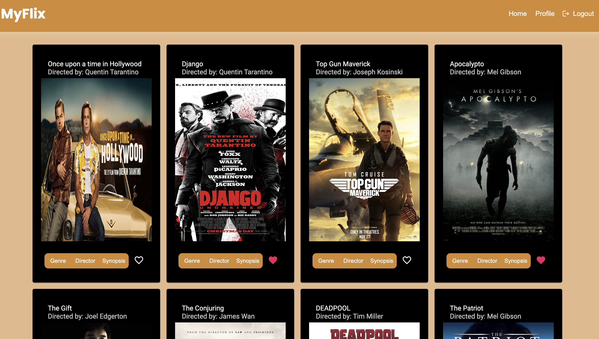
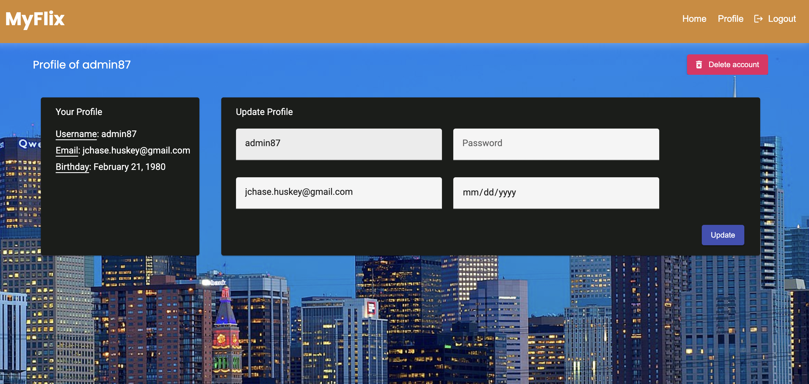
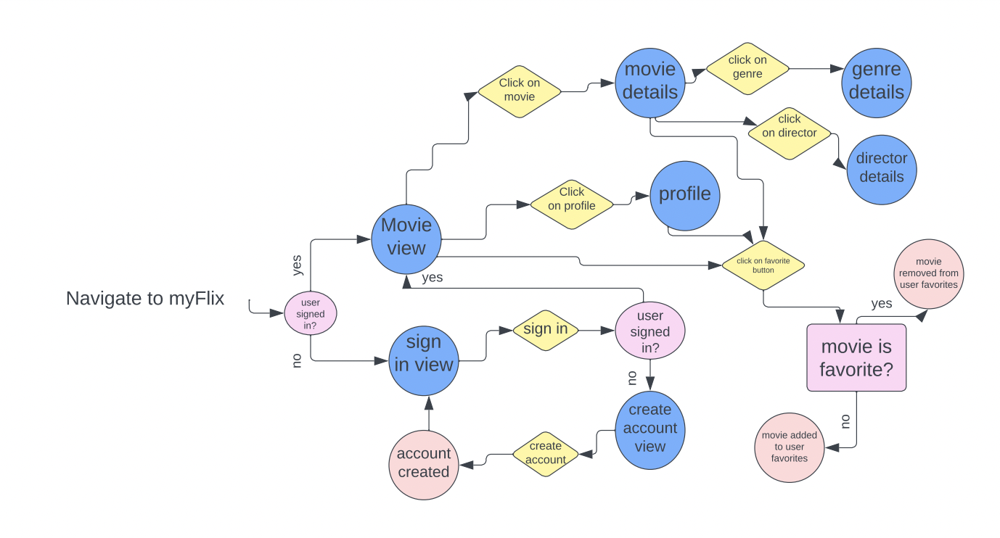

# MyFlixAngularClient

The client-side of a movie tracking app allowing users to create an account, access information about different movies and save them to their list of favorites. Users can also update their personal information, and delete their account. 

This project was generated with Angular CLI version 15.1.2.

# Key Features
* The app displays a welcome view where users can either log in or register an account.
* Once authenticated, the user navigates to the movies view which displays all movie cards.
* Each movie card contains the following:
* A "Genre" button, opening a dialog with details about the genre of that movie
* A "Director" button, opening a dialog with details about the director of that movie
* A "Summary" button, opening a dialog with a summary of that movie
* A "Favorite" button, toggling between adding and removing the movie to/from favorite list
* The title and image of the movie
* The user can navigate to the profile view where they can:
* Update their information
* Delete their account

The API for this application can be found on the movie_API repo.

---

# Live App: https://jchasehuskey.github.io/myFlix-Angular-client/welcome

# Tech Specs

* Angular ^15.2.4
* Angular Material ^15.0.0
* Node.js/ npm ^16.18.0
* TypeDoc ^0.23.22
* Github Pages

---

# Screenshots

### Login Page

### Home Page

### User Profile

# User Navigation

---

This project was generated with [Angular CLI](https://github.com/angular/angular-cli) version 15.2.4.

## Development server

Run `ng serve` for a dev server. Navigate to `http://localhost:4200/`. The application will automatically reload if you change any of the source files.

## Code scaffolding

Run `ng generate component component-name` to generate a new component. You can also use `ng generate directive|pipe|service|class|guard|interface|enum|module`.

## Build

Run `ng build` to build the project. The build artifacts will be stored in the `dist/` directory.

## Running unit tests

Run `ng test` to execute the unit tests via [Karma](https://karma-runner.github.io).

## Running end-to-end tests

Run `ng e2e` to execute the end-to-end tests via a platform of your choice. To use this command, you need to first add a package that implements end-to-end testing capabilities.

## Further help

To get more help on the Angular CLI use `ng help` or go check out the [Angular CLI Overview and Command Reference](https://angular.io/cli) page.
